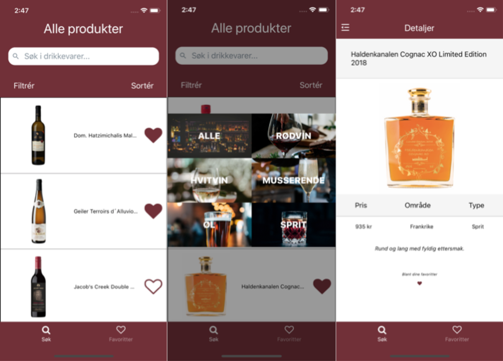

# Dokumentasjon

> Gruppe 24 | Prosjekt 4 | IT2810 Webutvikling 2019

###### Introduksjon

_Av Johanne Lie, Mathilde Tillman Hegdal og Hans Kristian Sande_
Denne appen har blitt laget i React Native med expo client.
Gruppen har valgt å ta i bruk implementasjonen av backend fra prosjekt 3 i prosjekt 4. Dermed baserer temaet i applikasjonen seg på et lignende vinmonopol og logikken er derfor mye av den samme. Spesielt interesserte henvises til readme fra prosjekt 3 dersom de vil lese mer om hvordan klient-siden er koblet sammen med server-siden (Se Apollo).

##### Funksjonalitet

**Søkegrensesnittet**\n
Gruppen har utviklet en app som lar deg søke på produkter i en drikke-katalog. Her kan du lese mer om de ulike produktene og merke dine egne favoritter til _Favoritter_. Ved å trykke på enkeltprodukter fra listen kan du inspisere nærmere, og blant annet sjekke om de finnes i _Favoritter_ fra før, hvis ikke kan du navigere til _Favoritter_ i tab-menyen for å få en fullstendig oversikt. Søket kan raffineres ved både filtrering og sortering.

**Infinite scroll**\n
I forrige prosjekt valgte gruppen å implementere dynamisk lasting av produkter ved blaing i sider. Gruppen diskuterte fordeler og ulemper med nettopp dét, og kom frem til at _infinite scroll_ ikke var like nødvendig for en applikasjon som kjører på PC. I motsetning til forrige gang skulle prosjekt 4 nå designes til mobil-apper, hvor det i mye større grad er hensiktsmessig med infinite scroll. Ved _loadMore_ og _fetchMore_ i _List.js_ lastes de 10 nye produktene inn hver gang du når enden av siden.

**React Navigation**\n
React Navigation er et tredjeparts-bibliotek gruppen har benyttet seg av til å håndtere navigering og overganger i appen. Istedenfor å ha en modal (pop-up) til å vise detaljert visning av produktet anså gruppen det som mer oversiktlig å ha separate skjermer for både produktside, og favorittside. Informasjonen som lastes på hver av sidene har dog litt forskjellig implementasjon. Produktsiden er en egen komponent i form av en _screen_ med et eget navn i et overordnet kart _ProductNav.js_ som spesifiserer routingen. Ved å benytte de innebygde metodene fra react-navigation kunne vi dermed mappe informasjonen fra et bestemt produkt til en bestemt produktside. Favorittsiden bygger på AsyncStorage.

**AsyncStorage**\n
Navigeringen fram til _Favoritter_ fungerer på samme måte som forklart med en StackNavigator fra react-navigation (ref. analogien til et kart). Det lastes ikke inn noe informasjon fra produktlisten til favorittsiden – de kommuniserer ikke. Men det de har til felles er at de kommuniserer med AsyncStorage, som ligger som et overordnet lag i appen. Produktlisten _List.js_ skriver til og sletter fra AsyncStorage som dermed holder oversikt på hvilke produkter som skal legges til som favoritter, eller fjernes som favoritter. Favorittsiden _Favorites.js_ laster data fra AsyncStorage og viser alle markerte favoritter. Lagringen av favoritter er persistent.
Et problem på veien var samhandlingen mellom favorittknappen og AsyncStorage. Dette viste seg å være det vanskeligste aspektet ved hele prosjekt 4 for gruppens del. Gruppen fikk AsyncStorage til å fungere ganske greit, men toggle _heart_-knappen var buggy og kun tidvis responsiv. Vanskeligheten kulminerte i rendering av async-funksjoner, hvilket naturligvis ga svært lite mening. Løsningen ble å bruke to _useEffect_-hooks, hvor den ene i _ListContainer.js_ laster inn de initiale favoritter, og den i _List.js_ oppdaterer favorittene til å matche det som er i AsyncStorage.

##### Videre krav til bruk av teknologi

**React Native & Expo**\n
Gruppen har som sagt utviklet produktet i React Native med flere forskjellige komponenter, hvorpå hovedkomponenten er _App.js_. Expo har blitt brukt til å teste applikasjonen underveis. Ettersom gruppen har både android- og ios-telefoner kunne vi jevnlig følge med på utviklingen og se til at det ble riktig begge steder. Expo hadde i tillegg mulighet til å kjøre simulator på flere utgaver av telefoner, hvilket også var til stor hjelp når vi testet for om designet var responsivt og applikasjonen kompatibel.

**Tredjepartskomponenter**\n
Tredjepartskomponentene gruppen har benyttet seg av har måttet passere to krav:

1. Enkle og tilpasningsdyktige i bruk.
2. Se bra ut.
   (Vi har valgt komponenter fra mange ulike biblioteker, men generelt brukt [Googles retningslinjer](https://material.io/design/iconography/product-icons.html#) for å hva vurdere hva som er god design)
   Noen steder vi har hentet tredjepartskomponenter fra: «react-native-elements», «react-native-vector-icons», «react-navigation», «react-navigation-material-bottom-tabs», «react-native».

##### Testing

Det brukes expo til å starte og teste appen vår. Man kjører prosjektet ved å skrive «expo start» i consolen. Du blir presentert en side hvor du enten kjører simulator for android, eller ios, eller på din egen mobil ved QR-scan. Hvis du skal kjøre den på din egen mobil må du ha en app for dette som heter Expo. Bare bruk kamera på mobilen og scan QR-koden. Deretter skal appen kjøre.
Vi har testet prosjektet med både Android telefon og Iphone. Vi har også testet e2e manuelt. Vi har blant annet testet søkefunksjonen, filtrering og sortering. Vi har e2e testet både på Iphone og Android.
 
| Test | Status|
| ------------- | ------------- |
| Filtrering | OK |
| Sortering | OK |
| Søke etter navn| OK |
| Kan legge til i favoritter | OK |
| Kan se mer informasjon om produktene | OK |
| Scrolling| OK |
| Kan bytte mellom tabs | OK |

##### Git

Vi har brukt Git og Gitlab til versjonshåndtering. Vi delte opp prosjektet i deloppgaver som ble lagt inn som issues på gitlab, og merket de med arbeidsstørrelse og type (feature/enhancement/bugfix). For å få bedre oversikt har vi etterstrevd å markere alle commits med hvilken issue de løser. Commits uten merknad kompenserer med en forklarende tekst.
